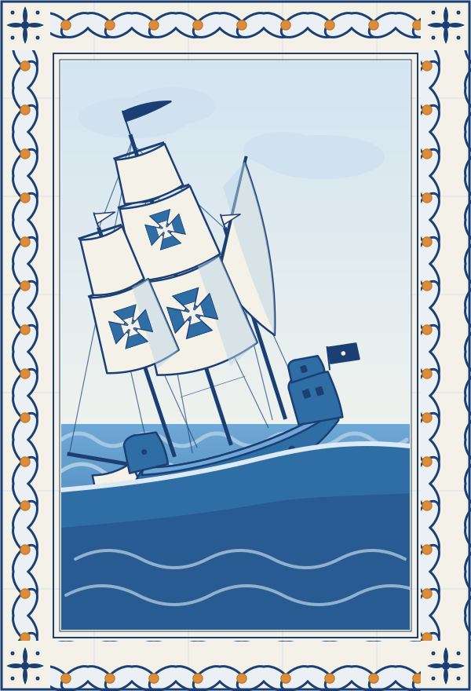
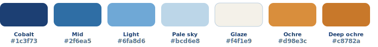

<p align="center">
  
</p>

<h1 align="center">Saga</h1>

<p align="center">
  A cross-platform desktop AI assistant with a <strong>local&nbsp;↔&nbsp;Claude router</strong> —
  runs a local model for the light work and escalates to Claude only when it's worth it,
  saving tokens (and money) on everything else.
</p>

<p align="center">
  <em>Built with Tauri 2 (Rust + web UI) · Windows · macOS · Linux</em>
</p>

<p align="center">
  
</p>

<p align="center">
  <em>Saga — the Norse goddess of wisdom, and a story worth telling. Named for the ships
  where Portugal's greatest sagas were written: an assistant that navigates between local and cloud.</em>
</p>

---

## Why

Most "chat with an LLM" apps send every keystroke to a paid frontier model — including trivial
work like reading your notes, summarizing, or classifying. Saga is **local-first**: your **Ollama
model is the assistant**, and **Claude is an optional escalation** you reach for on purpose.

- **Everything runs locally by default** on Ollama. Free, private, offline-capable.
- **Claude (CLI subscription or API) is optional.** With no Claude configured, Saga is a complete
  local assistant. Connect it to **escalate** a heavy turn — explicitly, not by a guess.
- **Escalate when you decide:** flip a turn to **Claude**, or hit **⤴ Ask Claude** on any local answer
  to re-run it on Claude. Before escalating, the local model **compresses the context** so fewer tokens are billed.

A live panel shows **tokens served locally (free)** against the actual **Claude cost**.

## Local-first, escalate on demand

```
                ┌───────────────┐
   user prompt  │  local model  │   default: runs on Ollama (free)
 ─────────────► │   (Ollama)    │
                └───────┬───────┘
                        │   you choose to escalate (Local|Claude switch, or ⤴ Ask Claude)
                        ▼
                ┌────────────────────────────┐
                │  compress context (local)   │
                │            ↓                │
                │  Claude  ── API  or  CLI ── │   optional — hidden when not configured
                └────────────────────────────┘
                        │
                        ▼
                  accounting: local (free) · Claude $
```

## Beyond chat — an agentic workspace

Conversations are **Sagas**. A left nav rail opens the workspace surfaces:

- **MCP host** — Saga is a [Model Context Protocol](https://modelcontextprotocol.io) client: point it at any
  stdio MCP server (filesystem, GitHub, Playwright, your own) and the model can call its tools
  (`mcp__<server>__<tool>`). Add and test servers under **Servidores**.
- **Skills & Playbooks** — reusable Markdown in your workspace. Skills auto-surface to the model
  (`load_skill`); playbooks are pulled on demand (`read_playbook`). The model can **create/edit** them on request.
- **Workflows** — saved agentic procedures. Type `/<name> args` to run one; it executes step-by-step with the
  available tools.
- **Browser tool** — a Playwright session (navigate / read / click / fill / screenshot) driven by tool-calling.
- **Web search** — toggle 🔎 to give the **local** model live web access (needs a tool-capable model like
  qwen3 / llama3.1). Pick an engine in **Models → Advanced**: **Jina** (default), Tavily, Brave, Serper or Exa
  (each with its own free-tier key, stored in the OS keychain), plus keyless DuckDuckGo as a best-effort
  fallback. Keyless scraping is unreliable in 2026, so a free key is recommended. Page fetching uses **Jina
  Reader** (`r.jina.ai`, keyless). Sources consulted are shown under each answer to verify the model searched.

Every tool call is **logged** (per-Saga *Atividade* view), and a **confirmation mode** (off / dry-run / ask)
can preview or require approval before any action runs. Workspace files live under a configurable folder
(`skills/`, `playbooks/`, `workflows/`) — editable in-app or in your own editor. Tools require **Claude API mode**.

## Two ways to reach Claude (user-selectable)

| Mode | How | Pros |
|------|-----|------|
| **Claude CLI** | spawns `claude -p … --output-format json` | reuses your Claude Code subscription, no API key |
| **API** | Anthropic Messages API over HTTPS | precise per-request token usage, no subprocess overhead |

Switch in **Settings → Claude → Mode**.

## Tech

- **Tauri 2** — Rust core, system webview, ~15 MB binaries, no Node.js runtime shipped.
- **Rust backend** — `reqwest` (Ollama + Anthropic HTTP), provider abstraction, router, token accounting.
- **Vanilla TypeScript + Vite** frontend — no heavy framework.
- Settings persisted as JSON under the OS config dir.

```
src-tauri/src/
  providers/   ollama · claude_api · claude_cli · openai_compat   (model backends)
  mcp/         MCP client + manager (stdio JSON-RPC host)
  tools/       browser sidecar + dispatcher (ToolHost)
  agent.rs     tool-use loop      orchestrator.rs  subagents
  workspace.rs skills / playbooks / workflows
  router.rs    triage → route → context compression
  store.rs     SQLite: Sagas, messages (FTS5), action log
  memory.rs · accounting.rs · settings.rs · commands.rs
src/
  main.ts      UI (rail, chat, managers, settings)
  api.ts       typed bindings   ·   caravel-loader.ts · zoom.ts
```

## Run it

Prerequisites: [Rust](https://rustup.rs), [Node.js](https://nodejs.org), and
[Ollama](https://ollama.com) with a model pulled (e.g. `ollama pull llama3.2`).
For Claude, either the [Claude CLI](https://docs.claude.com/claude-code) installed, or an
`ANTHROPIC_API_KEY`.

```bash
npm install
npm run tauri dev      # development
npm run tauri build    # production bundles for your OS
```

In **Settings**, point *Memory folder* at any directory of `.md` files (try `examples/memory/`)
and optionally a `CLAUDE.md`.

## Releasing

Pushing a `v*` tag triggers the GitHub Actions build (macOS Apple Silicon · Windows · Linux), which
**drafts** a release with the installers (`.dmg`, `.exe`/`.msi`, `.AppImage`/`.deb`/`.rpm`):

```bash
git tag v0.2.3 && git push origin v0.2.3
```

When the run is green, **publish the draft** from the Releases page — don't "create a new release" from the
tag, or you get an empty one without the installers.

Installers are currently **unsigned** (Windows SmartScreen / macOS Gatekeeper will warn — "More info → Run
anyway" / right-click → Open). To sign and re-enable **in-app auto-update**: set
`bundle.createUpdaterArtifacts: true`, generate an updater key (`npx @tauri-apps/cli signer generate`), put
the public key in `tauri.conf.json` → `plugins.updater.pubkey`, and add the `TAURI_SIGNING_PRIVATE_KEY` /
`_PASSWORD` CI secrets. For full code signing, add OS certs (Windows OV/EV; Apple Developer + notarization).

## Identity

Saga wears a **Portuguese _azulejo_** identity built on its caravel mark — cobalt-blue tilework with a
single ochre accent, the palette of the Age-of-Discovery tile panels. The app defaults to a light
"glaze" theme and switches to a dark "cobalt night" under `prefers-color-scheme: dark`.

<p align="center"></p>

| Asset | File |
|---|---|
| Hero panel (splash / empty state) | `assets/brand/caravel-panel.svg` |
| App icon mark (on the wave) | `assets/brand/caravel-mark-wave.svg` |
| Reference panel | `docs/brand/reference-caravel-panel.jpg` |

The SVG masters are the source of truth — platform icons are regenerated from them with
`npm run tauri icon`.

## Roadmap

**Done:** local-first assistant (Ollama) with optional one-click Claude escalation + context compression · real-time streaming · Sagas history + full-text
search (SQLite/FTS5) · image attachments (vision) · extended thinking & deep research · subagent
orchestration · agentic **browser tool** · **MCP host** · **skills / playbooks / workflows** · **action log +
confirm/dry-run** · side rail · interface zoom · OpenAI-compatible providers · in-app model downloader ·
azulejo identity + animated caravel loader · OS-keychain secrets · CI release builds ·
**rich artifacts** (Markdown/Mermaid/syntax-highlight, export, gallery) · **Saga export** ·
**iterative cited deep-research** · **scheduled automations** (cron, background runner + notifications) ·
**local web search** (Jina · Tavily · Brave · Serper · Exa, + keyless DuckDuckGo; **Jina Reader** for page fetch) ·
**compact / clear a Saga** (local-model summarization) · **PDF export** (print-to-PDF + `create_pdf` tool + bundled
skill) · **English / Portuguese UI** · per-provider keychain keys · **signed auto-update** (minisign artifacts +
`latest.json`, background download on launch) · external links open in the system browser ·
**live Ollama model browser** (search ollama.com with capability badges, full per-model variant/quant list, one-click
pull; per-model tuning via Modelfile defaults; VRAM-aware suggestion; LM Studio supported for chat, downloads via its own app) ·
**monochrome inline-SVG icon set** (`currentColor`, matching the side rail) ·
**clear Skills / Playbooks / Workflows / Agents distinction** (per-type help in the workspace) ·
**rich first-time experience** (multi-step welcome, hardware-aware model pick with one-click install, optional
Claude, friendly empty state + mini-tour) · **Agents** (reusable personas — *Software Engineer*, *Expert Web
Researcher*, *Writer* — system prompt + suggested toggles/route, picked in the composer) ·
**rich PDF design** (polished print theme: cover, type scale, styled headings/tables/callouts/code, page-break
control + page numbers via the `page.pdf()` path) · **system tray & start-on-login** (close-to-tray when
automations are scheduled) · **document attachments** (PDF / Word / Excel / text — extracted to text in Rust and
folded into context; images still go to vision) · **drag & drop** files onto the chat · **in-chat find**
(Ctrl/⌘+F over the current conversation) · **rich PDF templates** (Report / Article / Technical) ·
**resource-aware install warning** (flags models that likely exceed VRAM/RAM, non-blocking) ·
**rich document viewer** (open an attachment as the real file — PDF in the webview's native viewer, Word via
docx-preview, Excel via SheetJS — with a toggle to the extracted text the model actually read) ·
**grounded local deep-research** (small-model Self-Ask: decompose the question → search each sub-question →
Chain-of-Verification → answer only from the gathered evidence, anchored to today's date — closes the
current-facts gap at $0) · **adaptive context window** (sizes Ollama `num_ctx` to the prompt so long inputs don't
truncate the reply) · **model warm-up** (preloads the local model into VRAM on composer focus / launch for a
near-instant first token) · **live working feedback** (animated dots + ticking elapsed timer + phased status while
the model works) · **per-message generation time** · **vision model picker** (choose the image fallback from the
installed vision models; warns when none of the installed models can see) · **Claude CLI vision** (the CLI reads
image attachments; the prompt is piped via stdin so long conversations don't hit the command-line length limit) ·
**one-click Ollama optimize** (flash attention + q8_0 KV cache env vars, Windows) · **DuckDuckGo rate limiter**
(global request pacing + cooldown to avoid the keyless anti-bot blocks) ·
**Plan mode** (the model drafts an actionable step-by-step plan you **approve / edit / reject**, then executes it
step by step with a live status checklist; each step is reasoned/written, or grounded via the 🔎 toggle;
local-first on Ollama or on Claude — the planning sibling of grounded deep-research) ·
**keyless Mojeek failover** (when DuckDuckGo's anti-bot blocks, Mojeek takes over for a cooldown window —
grounding keeps working with no API key) · **per-step collapsible plan result** (the checklist becomes an
index: click a step to expand its content) + **numbered editable plan editor** ·
**clarification before planning** (a *deterministic* ambiguity gate — cheap text features, **not** model
self-judgment, which research shows over-flags — asks 1-3 slot-based questions only when the request is vague,
then plans with your answers; the planning counterpart of asking-before-acting) ·
**embedding-refined clarification** (an embedding classifier — auto-detecting any installed embed model — settles
the borderline cases the deterministic gate can't; degrades safely to L1 when none is installed) +
**adaptive per-model sensitivity** (answering/skipping the clarify card nudges a per-model threshold) ·
**focused per-step search queries** (keyword + clarified-region queries — e.g. "RTX 4090 price Portugal" — instead
of the verbose step label) · **live token streaming during Plan execution**.

**Next:**

- **First-time experience** *(current focus)* — make the first run delightful and self-explanatory beyond the
  existing welcome flow: detect an **incomplete setup** (Ollama not running, no model pulled, no embed model for
  the L2 clarification) and guide the fix inline; seed a couple of **example skills/workflows** so the Workspace
  isn't empty; **suggested starter prompts** in the empty state; a short **guided tour** of the key surfaces
  (composer toggles, route picker, Workspace, Automations). Goal: a new user is productive within a minute,
  without reading docs.
- **Zero-setup distribution** — bundle/auto-install Ollama as a managed sidecar (auto-pull a small default
  model on first run), package the Playwright sidecar (`externalBin`) so the browser tool needs no manual
  install. Goal: double-click the installer and it just works.
- **Code-sign & notarize installers** *(current focus)* — the updater is signed and auto-update is live; still
  pending is OS-level **code-signing + notarization** (Apple Developer ID / Windows Authenticode) to drop the
  "unknown publisher" warnings.
- **Projects** — a folder you add becomes a *project*: the models get **local context** for it (its file tree +
  on-demand reads), and **skills, playbooks & agents can be scoped per-project or shared** across all projects
  (a project-scoped doc overrides the shared one of the same name). Inside a project the agent gets **file tools
  — view, edit, create** within the folder, gated by a **permission mode**: **ask** (confirm each file action,
  reusing the action log + `confirm_mode`) or **auto** (runs unattended to the end — but **only after you approve
  a plan first**, extending Plan mode's draft → approve → execute to real file edits). Every auto run is
  **reversible** via **rollback**: the folder is snapshotted/checkpointed before the run starts, so one click
  undoes the whole thing. Builds on the existing Workspace (skills/playbooks/workflows/agents), action log, Plan
  mode and the agentic tool loop — this is the natural home for **Agentic Plan execution (v2)** below. Open:
  project context as plain file-tree + reads vs an indexed/RAG layer for large repos; rollback via per-run shadow
  git (stash/commit) vs a filesystem snapshot copy; and whether the file tools also run on the local route (today
  the agentic loop is Claude-only).
- **Topics** — group related Sagas under a **topic** (e.g. *MyPortal billing*, *house hunt*): a topic carries
  **shared context** every chat in it sees (a short brief + pinned notes + topic-scoped memory) and its own
  **Workspace scope** (skills/playbooks/agents that apply only to that topic's chats). Lighter-weight than a
  folder-backed **Project** (above): a Topic groups *conversations* and knowledge; a Project adds a local *folder*
  + file tools — so a Topic can later be **promoted** to a Project by attaching a folder. The side rail gains a
  topic filter/group and new Sagas inherit the active topic. Open: a chat in one topic vs many; whether topic
  memory is just a tagged slice of the existing memory store vs its own.
- **Self-distilling Workspace docs** (skills / playbooks / workflows) — the model watches a topic's chats and,
  when it spots something **replicable**, proposes capturing it — **choosing the right type for the pattern**, not
  always a playbook: a recurring **how-to you keep re-explaining** → a **playbook**; a stable piece of **domain
  knowledge or a reusable technique/convention** → a **skill**; a repeated **multi-step task you actually run**
  (search → read → format, or a fixed sequence of tool calls) → a **workflow**. Drafted via the existing *Generate
  with AI* path, scoped to that topic, and surfaced for one-tap **approve / edit before it's saved** (never written
  silently) — including the chance to **change the type** the model guessed. Once saved it auto-applies to the
  other chats in the same topic through the `active()` Workspace index. (**Agents** stay user-authored — a persona
  is a deliberate choice — though the distiller may *suggest* one.) Builds on: the AI doc generator, per-topic/Project
  scoping, and the per-item enable/disable toggles already in the Workspace. Open: the detection trigger
  (end-of-Saga summary pass vs a cheap local-model classifier per turn vs an explicit "capture this" affordance);
  the type-classification step (let the same generation pass pick the type); dedupe against existing docs of any
  type; keep it **opt-in** so it never feels intrusive.
- **Agentic Plan execution (v2)** — today Plan mode *generates* each step (reasoning/writing, optionally web-grounded);
  a v2 would let approved steps take **real actions** via the agentic tool loop (browser, workspace, MCP, files) on
  the Claude route, with per-step approval for risky ones.
- **Clarification v3 — self-consistency** — the embedding L2 and adaptive per-model sensitivity shipped; the
  remaining lever is a **self-consistency** signal (sample a few plan drafts, measure assumption divergence) for the
  hardest borderline calls.
- **Per-context model selection** — pick which model runs a task, since some models beat others per task (a coding
  model for code, gemma4 for planning, a small fast one for triage). Add a `model` field to **Agents** (the
  frontmatter already carries route/tools/research/subagents) and to **scheduled automations** (the runner uses the
  default model today), plus quick in-chat model switching to A/B the same prompt. Open: what happens when a named
  model isn't installed — fall back to the active model and warn?
- **Smart Saga** — in *normal* chat (not just Plan mode), the model decides when it actually needs the web and
  **asks you inline** before searching (e.g. "queres que pesquise os preços atuais?"), instead of guessing or
  hallucinating — the ask-before-acting / clarification pattern extended to regular chat.

**Open questions:**

- **High-performance inference backend?** — worth supporting **TabbyAPI / ExLlama (EXL3)** alongside Ollama, for
  ~2× single-stream speed and larger models within 12 GB VRAM? Trade-off: more setup vs more speed. The app already
  speaks OpenAI-compatible APIs, so a backend can be A/B-tested behind the same endpoint with **no code change**.
  (vLLM / TGI / SGLang are throughput/server engines — Linux-first, batching wasted for a single desktop user — so
  likely not the fit here. Internal-activation methods like sparse-neuron ambiguity probes stay out of reach until/unless
  the inference stack exposes hidden states.)

### Browser tool setup

The browser tool runs Playwright in a Node sidecar, kept Node-free in the Rust core:

```bash
cd sidecar
npm install
npx playwright install chromium
```

Then in **Settings → Ferramentas & Workspace**: enable the tool, set the sidecar path to `sidecar/index.js`,
and pick a user-data dir (the browser session/login persists there across runs). Browser tools require
**Claude API mode** (the CLI can't do tool-use here). Never hardcode credentials — log in once
interactively and the persistent context keeps the session.

## Limitations

- Streaming is real-time in API mode; the Claude **CLI** path is buffered (one chunk) — a known CLI limitation.
- Claude **CLI** mode can't accept images or drive tools; those force API mode.
- On Linux the system webview is WebKitGTK, which lags Chromium — the common Tauri/Wails trade-off.
- Token "savings" for locally-served requests are estimated (≈4 chars/token); Claude figures are exact.

## License

MIT © 2026 Gabriel Teixeira. Inspired by — but not derived from — projects like Odysseus; original code.
